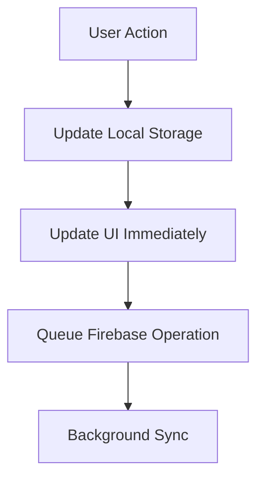
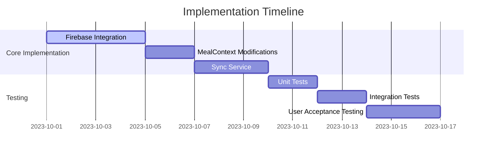

# Firebase Firestore Integration Implementation Plan

## Overview
This document outlines the implementation plan for integrating Firebase Firestore while maintaining offline support through AsyncStorage. The goal is to provide seamless cloud synchronization without disrupting existing functionality.

## Current Implementation Analysis

### Storage Mechanism
- Uses AsyncStorage with keys:
  - `@meals`
  - `@daily_summary` 
  - `@weekly_summary`

### Data Structure
```typescript
interface MealDetails {
  id: string;
  name: string;
  calories: number;
  protein: number;
  carbs: number;
  fat: number;
  timestamp: string;
}
```

### Data Flow
- Local-first architecture
- Context API for state management
- Daily/weekly summaries calculated from raw meal data

## Implementation Phases

### Phase 1: Firebase Integration (3-4 days)
- [ ] Setup Firestore Schema
```javascript
users/{userId}/
├── meals/{mealId}
│ ├── name: string
│ ├── calories: number
│ ├── protein: number
│ ├── carbs: number
│ ├── fat: number
│ ├── timestamp: timestamp
│ └── syncStatus: 'pending' | 'synced'
└── summaries/
  ├── daily/{date}
  └── weekly/{weekNumber}
```

- [ ] Create FirestoreService
```typescript
interface SyncQueueItem {
  operation: 'create' | 'update' | 'delete';
  data: MealDetails;
  timestamp: number;
}

class FirestoreService {
  private syncQueue: SyncQueueItem[] = [];

  async initialize(userId: string) {
    // Initialize Firestore with offline persistence
    firestore().settings({ persistence: true });
    // Sync existing local data
    await this.syncExistingData(userId);
  }

  private async syncExistingData(userId: string) {
    const localMeals = await AsyncStorage.getItem('@meals');
    if(localMeals) {
      await firestore().collection(`users/${userId}/meals`).add(JSON.parse(localMeals));
    }
  }
}
```

### Phase 2: Enhanced MealContext (2-3 days)
- [ ] Modify MealContext for dual storage
```typescript
const addMeal = useCallback(async (mealData) => {
  // 1. Write to AsyncStorage immediately
  const newLocalMeal = {...};
  setMeals(prev => [...prev, newLocalMeal]);
  
  // 2. Add to Firestore sync queue
  FirestoreService.queueOperation('create', newLocalMeal);
  
  // 3. Trigger background sync
  FirestoreService.triggerSync();
}, []);
```

### Phase 3: Sync Service Implementation (2-3 days)
- [ ] Implement SyncService
```typescript
class SyncService {
  private static isSyncing = false;

  static async syncData(userId: string) {
    if(this.isSyncing) return;
    this.isSyncing = true;
    
    try {
      const queue = await AsyncStorage.getItem('@syncQueue');
      if(queue) {
        await this.processQueue(JSON.parse(queue), userId);
      }
      await this.syncSummaries(userId);
    } finally {
      this.isSyncing = false;
    }
  }
}
```

## Data Flow Optimization

### Read Strategy
- [ ] First check Firestore cache
- [ ] Fallback to AsyncStorage
- [ ] Network request in background

### Write Strategy


## Testing Plan

### 1. Offline Scenarios
- [ ] Add/edit meals without internet
- [ ] Restart app to verify persistence
- [ ] Restore after 7 days offline

### 2. Sync Validation
- [ ] Conflict resolution tests
- [ ] Large dataset sync (1000+ meals)
- [ ] Cross-device synchronization

### 3. Performance Testing
- [ ] Measure sync operation impact
- [ ] Track memory usage
- [ ] Cold start performance

## Risk Mitigation

### Data Loss Prevention
- [ ] Daily backup to Firebase Storage
- [ ] Versioned API endpoints

### Failure Recovery
- [ ] Sync status monitoring
- [ ] Manual sync trigger
- [ ] Conflict resolution UI

## Timeline


## Progress Tracking

### Phase 1 Progress
- [ ] Firestore Schema Design
- [ ] Firebase Configuration
- [ ] Initial Sync Implementation

### Phase 2 Progress
- [ ] MealContext Updates
- [ ] AsyncStorage Integration
- [ ] Queue System Implementation

### Phase 3 Progress
- [ ] Sync Service Core
- [ ] Background Sync
- [ ] Conflict Resolution

### Testing Progress
- [ ] Offline Tests
- [ ] Sync Tests
- [ ] Performance Tests

## Notes
- Keep existing analytics calculations intact
- Maintain backward compatibility
- Focus on user experience during sync
- Monitor performance impact

## Dependencies
- Firebase SDK
- AsyncStorage
- React Context API
- Network Status Detection

## Sign-off
- [ ] Technical Review
- [ ] Security Review
- [ ] Performance Review
- [ ] User Experience Review 